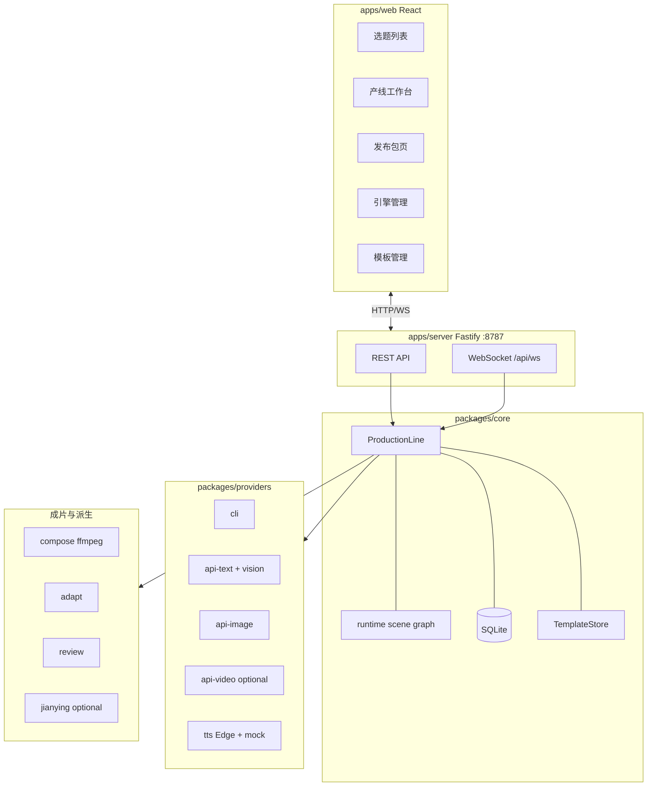
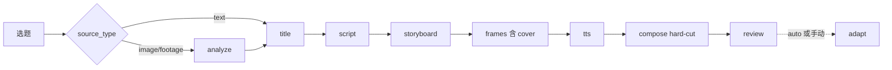
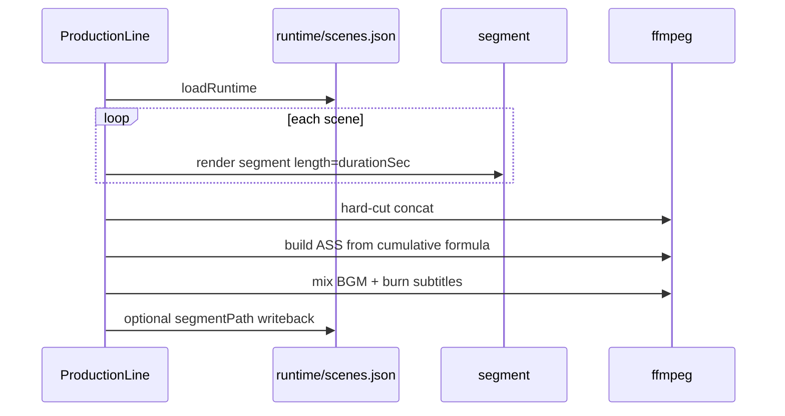
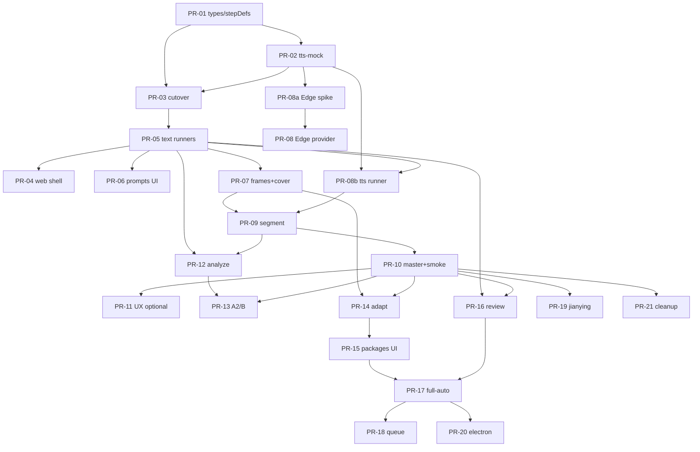

# 一条视频的自动化产线 —— 实现设计文档（V2）

| 字段 | 内容 |
|---|---|
| **文档标题** | 一条视频的自动化产线 · 实现设计（Implementation Design） |
| **作者** | （待填） |
| **日期** | 2026-07-11 |
| **状态** | **Approved**（R2 评审关闭 + Open Questions 已决议） |
| **依据** | `docs/开发说明书V2-一条产线重构版.md`（产品蓝本） |
| **前身** | V1 as-built：`docs/开发说明书.md` / `docs/架构说明.md` |
| **目标读者** | 负责从 V1 重构到 V2 的工程师 |

---

## 1. Overview

V1 把平台差异建模在「流水线」层级：12 条 pipeline JSON + 大量按平台复制的 Prompt 模板，且视频链路停在剪映草稿，成片无法一键产出。V2 产品模型推倒重来：

```
选题 × 1 条固定产线 = 1 条母版成片 mp4 → 派生 × N 个平台发布包
```

本设计文档把 V2 蓝本落地为可实施的技术规格：固定主线引擎、SQLite 数据模型、bootstrap 契约、runtime 场景图 SSOT、下游失效级联、逐步接口与 workspace 布局、ffmpeg 合成时间轴公式、TTS、platforms.json、REST/WS API、前端页面、风险与 PR 拆分。

实现路径 **深度优先**：先用 A1 纯文本 + **tts-mock** 打穿 `master.mp4`（M0–M3），再扩 A2/B（M4），再做平台派生与评审闭环（M5–M7）。

**一句话实现目标**：工程师按本文 + V2 蓝本，在 **`feat/v2` 长生命周期分支** 上重构出「本地 Node 服务 + 浏览器 UI」的短视频自动化产线；零 key 也能 mock 跑出可播放的演示 mp4。

---

## 2. Background & Motivation

### 2.1 V1 现状（代码真实结构）

| 层 | 路径 | 职责 |
|---|---|---|
| 服务 | `apps/server/src/{server,routes,seed,root}.ts` | Fastify REST + WS，端口 8787 |
| 前端 | `apps/web/src/pages/{Projects,ProjectDetail,PipelineBoard,Providers,Prompts}.tsx` | 项目 → 多流水线工作台 |
| 核心 | `packages/core/src/{db,engine,registry,templates,semaphore}.ts` | SQLite + **通用 DAG** `PipelineEngine.kick` |
| 引擎 | `packages/providers/src/{cli,apiText,apiImage,apiVideo,web,webSession}.ts` | Provider 工厂表 |
| 共享 | `packages/shared/src/{types,prompt,json}.ts` | 类型、`renderTemplate`、`extractJson` |
| 评审 | `packages/review/src/{index,wordlist}.ts` | 极限词 + `ruleCheck` |
| 剪映 | `packages/jianying/src/index.ts` | 分镜 → 草稿目录 + CSV（字段：`line`/`shot`/`durationSec`） |
| 流程定义 | `pipelines/*.json`（12 条）+ `nodes/*.json` | 平台×模式 DAG |
| 模板 | `prompts/**`（数十个，按平台×步骤复制） | V1 扩展点 |
| 桌面壳 | `apps/desktop/` | Electron（V2 延后） |

关键实现锚点：

- **DAG 调度**：`PipelineEngine.kick` 扫描 `steps.needs`，依赖满足则 `runStep`（`packages/core/src/engine.ts`）。
- **Prompt 注入**：`composePrompt` + `PLATFORM_VOICE` + `CONTENT_RULES` + `{{var}}`。
- **产物版本**：`workspace/project-<id>/pipeline-<id>/<def_id>/v<N>/`。
- **引擎并发**：`ProviderRegistry` + `Semaphore`。
- **Mock 体系**：`seed.ts` 写入 `cli-mock` / `img-mock` / `video-mock`；`scripts/mock-llm.mjs`（**V1 形状，见 §4.6.10 必须改写为 V2**）。
- **路径沙箱**：V1 使用 `resolved.startsWith(workspaceDir)`（Windows 大小写/分隔符有隐患，V2 改为 `path.relative` 校验，见 §10）。

### 2.2 痛点

1. **平台差异是参数，被做成了流程**。  
2. **语义反了**：多平台 = 多次独立生成 = 成本 ×N。  
3. **深度不足**：剪映草稿 + AI 猜 `durationSec`，无法自动成片。  
4. **宽度过载**：图文/MV/web 分散成片攻坚。

### 2.3 V2 要解决什么

- 固定主线 + 代码内步骤顺序；删除通用 DAG 与 12 条 pipeline。  
- TTS 实测时长作为镜头主时钟 → ffmpeg 分段合成 `master.mp4`。  
- `platforms.json` 驱动 adapt；发布包一等公民。  
- 三种信息源在 `scene.source` 汇合，产线不分叉。

---

## 3. Goals & Non-Goals

### 3.1 Goals

1. **打穿成片**：选题 → … → `master.mp4`（1080×1920 H.264 30fps）。  
2. **同源多平台**：母版一次，adapt × N 发布包。  
3. **零 key 可演示**：cli/img/**tts-mock** 端到端可播 mp4（M3 硬验收；**不依赖 Edge-TTS**）。  
4. **可迁移资产最大化**：providers/review/shared/jianying/seed/sharp。  
5. **信息源可扩展**：`source_type` / `scene.source` 首日入库；M4 接 A2/B。

### 3.2 Non-Goals

| 不做 | 说明 |
|---|---|
| 多平台独立流水线 | 删除 `pipelines/` 模型 |
| 图文 / 长文 / 图集 / MV | 删除对应模板与 `mvkit` 主链路 |
| 自动发布 | 仅导出 ZIP |
| Playwright web 适配器 | 删除 `web.ts` / `webSession.ts` |
| 多用户 / 云端 | 单机 127.0.0.1 |
| Electron | M7 可选 |

---

## 4. Proposed Design

### 4.1 目标 monorepo 结构（Keep / Migrate / Delete）

```
OnlyOneAIVideo/
├── apps/
│   ├── server/                 ✅ KEEP 外壳；routes/seed 大改
│   ├── web/                    ✅ KEEP 外壳；页面按 V2 重做
│   └── desktop/                ⏸ DEFER
├── packages/
│   ├── shared/                 ✅ MIGRATE（类型收缩 + 扩展）
│   ├── core/                   🔄 REWRITE 引擎；MIGRATE db 模式
│   │   └── src/
│   │       ├── db.ts
│   │       ├── pipeline.ts     # ProductionLine + kick + invalidation
│   │       ├── stepDefs.ts     # MAINLINE_STEP_DEFS（bootstrap 契约）
│   │       ├── steps/          # runners map
│   │       │   ├── index.ts
│   │       │   ├── analyze.ts | title.ts | script.ts | storyboard.ts
│   │       │   ├── frames.ts | tts.ts | compose.ts | review.ts | adapt.ts
│   │       ├── sceneGraph.ts   # runtime.json SSOT 读写
│   │       ├── compose/        # ffmpeg 工具
│   │       ├── registry.ts | semaphore.ts
│   │       └── templates.ts    # Prompt-only
│   ├── providers/              ✅ MIGRATE：删 web；新增 tts
│   ├── review/                 ✅ KEEP
│   └── jianying/               ✅ KEEP 可选导出（需字段适配器）
├── platforms/platforms.json    ⭐ NEW
├── prompts/                    🔄 **9 个根模板**（7 核心 + review-cover + 可再扩）
│   ├── analyze-image.md | analyze-footage.md
│   ├── title.md | script.md | storyboard.md | cover.md
│   ├── adapt-copy.md | review.md | review-cover.md
├── assets/{fonts,bgm}/
├── scripts/{mock-llm.mjs,smoke-v2.mjs}  # mock-llm 必须输出 V2 契约（§4.6.10），非原样 KEEP
├── workspace/ | data/ | docs/
```

| V1 资产 | V2 处置 |
|---|---|
| `pipelines/*`、`nodes/*`、平台 prompts | **DELETE**（在 cutover PR / PR-21；`feat/v2` 上尽早删以免误用） |
| `engine.ts` DAG | **REWRITE** → `pipeline.ts` |
| `mvkit.ts` | **DELETE** 或隔离 |
| `providers/web*.ts` | **DELETE** |
| providers cli/api* + mock | **MIGRATE** + tts |
| review / shared / jianying | **MIGRATE**（jianying 需 narration→line 映射） |
| seed + recoverInterrupted | **MIGRATE** + tts-mock |

### 4.2 总体架构



### 4.3 固定主线引擎（替换通用 DAG）

#### 4.3.1 为什么不保留 DAG

顺序固定；分支仅 A1 跳过 analyze。通用 `needs` 无收益。调度写死在代码。  
**中间形态**：`MAINLINE` 有序数组 + `MAINLINE_STEP_DEFS` 元数据（见下）——这是「代码内步骤表」，不是可配置 DAG。

#### 4.3.2 步骤枚举与执行顺序

```typescript
// packages/shared/src/types.ts
export type StepId =
  | "analyze" | "title" | "script" | "storyboard"
  | "frames" | "tts" | "compose" | "review" | "adapt";

export type SourceType = "text" | "image" | "footage"; // A1 / A2 / B
export type SceneSource = "generated" | "footage";
export type ProviderKind = "cli" | "api-text" | "api-image" | "api-video" | "tts";
// 删除 "web"

export type StepStatus =
  | "pending" | "running" | "waiting_human"
  | "succeeded" | "failed" | "cancelled" | "skipped";

export type TopicStatus =
  | "pending" | "running" | "waiting_human" | "succeeded" | "failed";
```

**固定顺序（步骤级严格串行）**：

```
analyze → title → script → storyboard → frames → tts → compose → review → (adapt)
```

- 镜头级并行：仅在 `frames` / `tts` **步骤内部**。  
- `adapt`：默认不进自动主线；`POST /api/topics/:id/adapt` 或全自动 review 通过后触发。



#### 4.3.3 Bootstrap 契约：`MAINLINE_STEP_DEFS`（阻塞项）

创建选题时 `bootstrapSteps(topicId)` **必须**按下列常量落库。seed 保证 mock id 始终存在：`cli-mock`、`img-mock`、`video-mock`、`tts-mock`。

```typescript
// packages/core/src/stepDefs.ts
export interface StepDefMeta {
  id: StepId;
  name: string;
  /** 相对 prompts/ 的路径；null = 不调 LLM 模板 */
  prompt: string | null;
  /** 默认是否 human_gate（auto 模式运行时会忽略 title 的 gate） */
  humanGate: boolean;
  /** 是否必须绑定 provider；false = 纯代码步骤 */
  requiresProvider: boolean;
  /** 允许的 provider.kind（按优先序） */
  providerKinds: ProviderKind[];
  /** 解析失败时的 mock / 推荐 id */
  defaultProviderId: string | null;
  /** 是否计入 topic「主线完成」判定（adapt 默认 false） */
  requiredForTopicSuccess: boolean;
}

export const MAINLINE: StepId[] = [
  "analyze", "title", "script", "storyboard",
  "frames", "tts", "compose", "review", "adapt",
];

export const MAINLINE_STEP_DEFS: Record<StepId, StepDefMeta> = {
  analyze: {
    id: "analyze", name: "素材理解",
    prompt: null, // 运行时按 source_type 选 analyze-image.md / analyze-footage.md
    humanGate: true, requiresProvider: true,
    providerKinds: ["api-text"], // 需 vision；无可用时 mock 文本引擎无法真读图，M4 真跑
    defaultProviderId: "api-grok-vision", // 未启用则 resolve 时回落（M0 A1 直接 skipped）
    requiredForTopicSuccess: true,
  },
  title: {
    id: "title", name: "标题",
    prompt: "title.md", humanGate: true, requiresProvider: true,
    providerKinds: ["cli", "api-text"],
    defaultProviderId: "cli-mock",
    requiredForTopicSuccess: true,
  },
  script: {
    id: "script", name: "口播稿",
    prompt: "script.md", humanGate: false, requiresProvider: true,
    providerKinds: ["cli", "api-text"],
    defaultProviderId: "cli-mock",
    requiredForTopicSuccess: true,
  },
  storyboard: {
    id: "storyboard", name: "分镜表",
    prompt: "storyboard.md", humanGate: false, requiresProvider: true,
    providerKinds: ["cli", "api-text"],
    defaultProviderId: "cli-mock",
    requiredForTopicSuccess: true,
  },
  frames: {
    id: "frames", name: "逐镜画面+封面",
    prompt: "cover.md", // 镜头 visual 用内联 orientation；封面用 cover.md
    humanGate: false, requiresProvider: true,
    providerKinds: ["api-image"],
    defaultProviderId: "img-mock",
    requiredForTopicSuccess: true,
  },
  tts: {
    id: "tts", name: "逐镜配音",
    prompt: null, humanGate: false, requiresProvider: true,
    providerKinds: ["tts"],
    defaultProviderId: "tts-mock",
    requiredForTopicSuccess: true,
  },
  compose: {
    id: "compose", name: "合成母版",
    prompt: null, humanGate: false, requiresProvider: false,
    providerKinds: [], defaultProviderId: null,
    requiredForTopicSuccess: true,
  },
  review: {
    id: "review", name: "评审",
    prompt: "review.md", humanGate: false, requiresProvider: true,
    providerKinds: ["api-text", "cli"],
    defaultProviderId: "cli-mock", // 真环境优先 api-deepseek（seed 启用时 resolve 可偏向）
    requiredForTopicSuccess: true,
  },
  adapt: {
    id: "adapt", name: "平台派生",
    prompt: "adapt-copy.md", humanGate: false, requiresProvider: true, // 文案改写需要；视频/封面纯代码
    providerKinds: ["api-text", "cli"],
    defaultProviderId: "cli-mock",
    requiredForTopicSuccess: false, // 默认不挡 topic succeeded
  },
};
```

**Provider 解析顺序**（`resolveProvider(step, topicOverrides?)`）：

1. `steps.provider_id` 若存在且 enabled  
2. topic 级 override map（可选，`options.providerOverrides[stepId]`）  
3. 第一个 **enabled** 且 `kind ∈ providerKinds` 的 provider（优先非 mock，再 mock）  
4. `defaultProviderId` 若 enabled  
5. 若 `requiresProvider` 仍为空 → 步骤失败，错误信息明确「未绑定引擎」

**bootstrapSteps 行为**：

```typescript
function bootstrapSteps(topicId: number, sourceType: SourceType, auto: boolean) {
  for (const id of MAINLINE) {
    const def = MAINLINE_STEP_DEFS[id];
    let status: StepStatus = "pending";
    let humanGate = def.humanGate;
    if (id === "analyze" && sourceType === "text") status = "skipped";
    if (id === "title" && auto) humanGate = false; // 全自动跳过标题卡点
    if (id === "analyze" && auto) humanGate = false; // 全自动跳过摘要卡点（可配置）
    const providerId = def.requiresProvider
      ? resolveProvider(def, /* overrides */)?.id ?? def.defaultProviderId
      : null;
    repo.createStep({ topicId, stepId: id, name: def.name, status, humanGate, providerId });
  }
}
```

A1 的 `analyze=skipped` 在 **bootstrap 时** 写入，不在第一次 kick 时再判断。

#### 4.3.4 ProductionLine 接口与 kick 语义

```typescript
export class ProductionLine extends EventEmitter {
  private inflight = new Set<number>(); // step row id，防双跑
  private topicInflight = new Set<number>(); // 同 topic 互斥 kick 推进
  private feedback = new Map<number, string>();
  private autoRetries = new Map<number, number>(); // topicId → 轮次，≤1

  bootstrapSteps(topicId: number): void;
  kick(topicId: number): void;
  rerunStep(stepRowId: number, feedback?: string): void;
  /** 人工卡点确认 → succeeded → 始终 kick（对齐 V1 engine.confirmHumanGate） */
  confirmHumanGate(stepRowId: number): void;
  /** 选定产物；按 artifact 角色做差异化失效后，按 §4.3.6.1 决定是否 kick */
  selectArtifact(artifactId: number): void;
  rerollScene(topicId: number, sceneIndex: number, parts: SceneRerollPart[]): Promise<void>;
  runAdapt(topicId: number, platforms: string[]): Promise<void>;
  recoverInterrupted(): void; // running → failed
}

type SceneRerollPart = "frame" | "tts" | "segment";
```

**`kick(topicId)` 伪代码（固定主线，一次只跑下一步）**：

```typescript
kick(topicId: number): void {
  if (this.topicInflight.has(topicId)) return; // 已有推进循环
  this.refreshTopicStatus(topicId);

  const topic = repo.getTopic(topicId)!;
  const steps = repo.listStepsByTopic(topicId); // 按 MAINLINE 序
  const byId = new Map(steps.map(s => [s.step_id, s]));

  // 全局：M7 前默认同时最多 1 个 topic 处于 running 推进（可配置）
  if (countTopicsRunning() >= MAX_RUNNING_TOPICS /* default 1 */
      && topic.status !== "running" && topic.status !== "waiting_human") {
    return; // 或入队
  }

  // 找主线上第一个未完成的「有效」步骤
  for (const stepId of MAINLINE) {
    const step = byId.get(stepId)!;

    if (step.status === "skipped" || step.status === "succeeded") continue;
    if (step.status === "failed" || step.status === "cancelled") {
      this.refreshTopicStatus(topicId);
      return; // 停止推进
    }
    if (step.status === "waiting_human") {
      this.refreshTopicStatus(topicId);
      return; // 等待 confirm
    }
    if (step.status === "running" || this.inflight.has(step.id)) {
      return; // 已在跑
    }
    if (step.status !== "pending") continue;

    // adapt：非 auto 且未显式请求时不自动执行
    if (stepId === "adapt" && !topic.auto && !this.adaptRequested.has(topicId)) {
      this.refreshTopicStatus(topicId);
      return;
    }

    // 启动唯一下一步
    this.inflight.add(step.id);
    this.topicInflight.add(topicId);
    void this.runStep(step.id)
      .finally(() => {
        this.inflight.delete(step.id);
        this.topicInflight.delete(topicId);
        this.refreshTopicStatus(topicId);
        // 成功则继续推进；失败/waiting 则 stop
        const st = repo.getStep(step.id)!;
        if (st.status === "succeeded" || st.status === "skipped") {
          this.kick(topicId);
        }
      });
    return;
  }
  this.refreshTopicStatus(topicId);
}
```

**`runStep` 要点**：

- `requiresProvider === false`（compose）：不调 `registry.get`，直接 `runners.compose`。  
- 否则 `resolveProvider` → semaphore → `runners[stepId](ctx)`。  
- Runner 注册表：`packages/core/src/steps/index.ts` → `Record<StepId, StepRunner>`。  
- 文本类：`composePrompt` 用 `MAINLINE_STEP_DEFS[id].prompt`；analyze 按 source 选模板。  
- title 结束：非 auto 且 humanGate → `waiting_human`；auto → 选第一候选 `succeeded`。  
- 超时：默认 10min/步；compose 30min。

#### 4.3.5 Topic 状态聚合 `refreshTopicStatus`

```typescript
function refreshTopicStatus(topicId: number): void {
  const steps = repo.listStepsByTopic(topicId);
  const required = steps.filter(s => MAINLINE_STEP_DEFS[s.step_id as StepId].requiredForTopicSuccess);
  // skipped 视为「已完成」
  const done = (s: StepRow) => s.status === "succeeded" || s.status === "skipped";

  let status: TopicStatus;
  if (required.some(s => s.status === "running" || inflight.has(s.id))) status = "running";
  else if (required.some(s => s.status === "waiting_human")) status = "waiting_human";
  else if (required.some(s => s.status === "failed")) status = "failed";
  else if (required.every(done)) status = "succeeded";
  else status = "pending";

  // 注意：adapt 未跑不影响 succeeded
  if (topic.status !== status) {
    repo.setTopicStatus(topicId, status);
    emit({ type: "topic-status", topicId, data: { status } });
  }
}
```

**并发策略（M0–M6）**：

- 同 topic：`topicInflight` + step `inflight` 防重入。  
- 跨 topic：`MAX_RUNNING_TOPICS = 1`（env 可调）；M7 批量队列再放开。  
- `recoverInterrupted`：所有 `running` 步骤 → `failed`（文案：服务重启…），topic 同步 `failed`。

#### 4.3.6 下游失效级联（Invalidation）

V1 `rerunStep` **不**重置依赖方；V2 主线末端是 mp4，必须级联。  
**封面是 frames 步的 artifact（`meta.role="cover"`），不是独立 step**——选封面不得误伤 tts/compose（K20）。

| 触发 | 行为 |
|---|---|
| `rerunStep(S)` | S → `pending`（error 清空）；**MAINLINE 中 S 之后所有步骤** → `pending`（保留旧 artifact，不删文件）；topic 重算；然后 **`kick`** |
| `selectArtifact`：**title / script / storyboard**（叙事类） | 当前步保持 `succeeded`；从**该步的下一步**起全部 `pending`；storyboard 另见下行 |
| `selectArtifact`：**storyboard** 换版本 | **重置** `runtime/scenes.json`（`initFromStoryboard`）；下游 frames→…→review → `pending` |
| `selectArtifact`：**`meta.role="cover"`**（frames 步内封面候选） | **仅** `adapt` → `pending`；可选将 review 标 pending **仅当**已存在 cover 维度评审且要复评；**绝不**将 tts / compose / frames 本体 / script 等置 pending（封面不进 master 视频时钟） |
| `selectArtifact`：**`meta.role="frame"`** 或镜头画面候选（若 UI 允许多选一） | 仅该镜 runtime.framePath 更新 + **compose** → `pending`（与 `rerollScene(["frame"])` 同级）；**不**重置 tts（旁白未变）除非实现选择强制 segment 重渲时已有 audio |
| `rerollScene(parts)` | 只更新指定 parts + 若含 frame/tts/segment 任一项则 compose → `pending` 并重跑 segment→concat→mix→ASS；**不**重置 title/script |
| review auto 重生成 title/script | 目标步 pending + review pending + **级联下游**（与 `rerunStep` 同） |

状态 UI：下游从 `succeeded` 被打回 `pending` 时，前端可显示「已过期，待重跑」（DB 仍用 `pending`）。

**不删除**旧 `vN` 目录与 artifact 行。

##### 4.3.6.1 `confirmHumanGate` / `selectArtifact` 之后是否 `kick`（对齐 V1）

V1：`confirmHumanGate` 在 `engine.ts` 置 `succeeded` 后 **立即 `kick(pipelineId)`**。V2 必须同等行为，避免 UI 卡在「已确认但下游不跑」。

```typescript
confirmHumanGate(stepRowId: number): void {
  const step = repo.getStep(stepRowId)!;
  if (step.status !== "waiting_human") throw new Error("不在等待人工确认");
  // 若 title 尚未 selected，自动选第一候选（防御）
  ensureSelectedArtifact(step);
  repo.setStepStatus(stepRowId, "succeeded", { finished: true });
  emit step-status succeeded;
  this.kick(step.topic_id); // ★ 始终 kick
}

selectArtifact(artifactId: number): void {
  const art = repo.selectArtifact(artifactId); // DB 层改 selected
  const step = repo.getStep(art.step_row_id)!;
  const role = parseMeta(art).role; // "cover" | "frame" | undefined

  // 按 §4.3.6 表做差异化 cascade（可能把下游标 pending）
  const pendingTouched = this.invalidateAfterSelect(step, art, role);

  // kick 策略（默认始终尝试推进，与 V1 confirm 一致）：
  // - 只要本 topic 没有「另一个」仍 waiting_human 的卡点，就 kick
  // - 若当前步仍是 waiting_human（只改选了标题、尚未 confirm），kick 会在该步停下——无害
  // - 若仅 adapt 被 pending（换封面），kick 在非 auto 下不会自动跑 adapt（见 kick 伪代码），用户需点「生成发布包」；这是正确的
  if (pendingTouched || step.status === "waiting_human") {
    this.kick(step.topic_id);
  }
  // 注：不提供 kickOnSelect=false 默认；若未来需要「只改选不推进」，用显式 query ?kick=0，默认 kick=1
}
```

| 用户动作 | 期望 |
|---|---|
| 选标题 + **确认** | select（可能 cascade）→ confirm → **kick** 跑 script… |
| 仅换封面 selected | adapt pending；**kick** 但非 auto 不进 adapt；tts/compose 保持 succeeded |
| 换 storyboard 版本 | frames… pending；**kick** 从 frames 重跑 |
| `rerunStep` | 已规定末尾 **kick** |

路由：`POST /api/artifacts/:id/select` 与 `POST /api/steps/:id/confirm` 均在 ProductionLine 方法内完成 cascade+kick，handler 不再要求前端二次 `run`。

#### 4.3.7 composePrompt 迁移

- `renderTemplate` ✅  
- `CONTENT_RULES` ✅ → title/script  
- `PLATFORM_VOICE` ❌ 主线移除；仅 adapt-copy 的 `{{platform.voice}}`  
- materials / requirements / feedback ✅  
- 母版标题不限平台字数 ✅  

#### 4.3.8 事件类型

```typescript
export type EngineEvent =
  | { type: "topic-status"; topicId: number; data: { status: TopicStatus } }
  | { type: "step-status"; topicId: number; stepId: StepId; data: any }
  | { type: "step-stream"; topicId: number; stepId: StepId; data: { chunk: string } }
  | { type: "artifact"; topicId: number; stepId: StepId; data: any }
  | { type: "scene-progress"; topicId: number; data: { sceneIndex: number; phase: string; pct?: number } }
  | { type: "compose-progress"; topicId: number; data: { phase: string; pct: number; message?: string } }
  | { type: "review"; topicId: number; data: any }
  | { type: "package"; topicId: number; data: any };
```

前端 **必须** 改 `api.ts` 与所有页面：事件字段 `pipelineId` → `topicId`，并处理新事件类型（不是「几乎不用改」）。

---

### 4.4 数据模型

#### 4.4.1 目标 Schema

```sql
CREATE TABLE IF NOT EXISTS schema_version (version INTEGER NOT NULL);

CREATE TABLE IF NOT EXISTS topics (
  id INTEGER PRIMARY KEY AUTOINCREMENT,
  title TEXT NOT NULL,
  source_type TEXT NOT NULL CHECK (source_type IN ('text','image','footage')),
  brief_json TEXT NOT NULL,
  status TEXT NOT NULL DEFAULT 'pending',
  auto INTEGER NOT NULL DEFAULT 0,
  options_json TEXT NOT NULL DEFAULT '{}',
  -- M7/K25：批量排队序；NULL=不在队列；越小越先；单 worker 按升序串行 kick
  queue_order INTEGER,
  created_at TEXT NOT NULL DEFAULT (datetime('now','localtime'))
);
CREATE INDEX IF NOT EXISTS idx_topics_queue ON topics(queue_order) WHERE queue_order IS NOT NULL;

CREATE TABLE IF NOT EXISTS materials (
  id INTEGER PRIMARY KEY AUTOINCREMENT,
  topic_id INTEGER NOT NULL REFERENCES topics(id),
  kind TEXT NOT NULL CHECK (kind IN ('text','image','video','file')),
  original_name TEXT,
  file_path TEXT,
  content TEXT,
  note TEXT,
  created_at TEXT NOT NULL DEFAULT (datetime('now','localtime'))
);

CREATE TABLE IF NOT EXISTS steps (
  id INTEGER PRIMARY KEY AUTOINCREMENT,
  topic_id INTEGER NOT NULL REFERENCES topics(id),
  step_id TEXT NOT NULL,
  name TEXT NOT NULL,
  status TEXT NOT NULL DEFAULT 'pending',
  provider_id TEXT,
  prompt_rendered TEXT,
  human_gate INTEGER NOT NULL DEFAULT 0,
  started_at TEXT,
  finished_at TEXT,
  error TEXT,
  UNIQUE(topic_id, step_id)
);

CREATE TABLE IF NOT EXISTS artifacts (
  id INTEGER PRIMARY KEY AUTOINCREMENT,
  step_row_id INTEGER NOT NULL REFERENCES steps(id),
  version INTEGER NOT NULL DEFAULT 1,
  kind TEXT NOT NULL,              -- text|image|audio|video|file|json
  label TEXT,
  content TEXT,
  file_path TEXT,
  meta_json TEXT,                  -- { sceneIndex, durationSec, role: "cover"|"frame"|... }
  selected INTEGER NOT NULL DEFAULT 0,
  created_at TEXT NOT NULL DEFAULT (datetime('now','localtime'))
);

CREATE TABLE IF NOT EXISTS packages (
  id INTEGER PRIMARY KEY AUTOINCREMENT,
  topic_id INTEGER NOT NULL REFERENCES topics(id),
  platform TEXT NOT NULL,
  video_path TEXT,
  title TEXT,
  caption TEXT,
  cover_paths_json TEXT NOT NULL DEFAULT '[]',
  checklist_json TEXT NOT NULL DEFAULT '[]',
  status TEXT NOT NULL DEFAULT 'draft',
  created_at TEXT NOT NULL DEFAULT (datetime('now','localtime')),
  UNIQUE(topic_id, platform)
);

CREATE TABLE IF NOT EXISTS providers (
  id TEXT PRIMARY KEY,
  kind TEXT NOT NULL,
  name TEXT NOT NULL,
  config_json TEXT NOT NULL DEFAULT '{}',  -- model/apiKey 等一律进 config，无独立 model 列
  max_concurrency INTEGER NOT NULL DEFAULT 1,
  enabled INTEGER NOT NULL DEFAULT 1
);

CREATE TABLE IF NOT EXISTS prompt_overrides (
  path TEXT PRIMARY KEY,
  content TEXT NOT NULL,
  updated_at TEXT NOT NULL DEFAULT (datetime('now','localtime'))
);

CREATE TABLE IF NOT EXISTS reviews (
  id INTEGER PRIMARY KEY AUTOINCREMENT,
  step_row_id INTEGER NOT NULL REFERENCES steps(id),
  artifact_id INTEGER,
  provider_id TEXT NOT NULL,
  target TEXT NOT NULL,
  scores_json TEXT NOT NULL,
  total REAL NOT NULL,
  verdict TEXT NOT NULL,
  issues_json TEXT NOT NULL,
  suggestions_json TEXT NOT NULL,
  created_at TEXT NOT NULL DEFAULT (datetime('now','localtime'))
);
```

#### 4.4.2 概念映射

| V1 | V2 |
|---|---|
| `projects` | `topics` |
| `pipelines` | **删除** |
| `steps.pipeline_id` + `def_id` | `steps.topic_id` + `step_id` |
| artifacts text/image/file | + audio/video/json |
| — | `packages` |
| providers 含 web | + tts，无 web；**无 model 列**（与 V1 一致，模型在 config_json） |

#### 4.4.3 迁移与分支 Cutover 策略（K18）

**禁止**在仍服务 V1 路由的 `main` 上单独合入「破坏性 schema」。

| 策略 | 说明 |
|---|---|
| **分支** | 全部 V2 工作在 **`feat/v2` 长生命周期分支**；不保证 PR-01 单独合 `main` 后 `pnpm dev` 仍跑 V1 |
| **Cutover 单元** | **C0 = PR-01+PR-02+PR-03（可拆分审查，但必须同分支连续合并）**：同一时刻切换 schema + ProductionLine + topics 路由。在 C0 完成前，不删 V1 表或不启动半迁移库 |
| **库处理** | C0 启动时：若 `schema_version < 2`，备份 `amp.db` → `amp.v1.bak.db`，**整库重建 V2 表**，`schema_version=2`。可选从备份恢复 `providers`（`kind!='web'`）与 `prompt_overrides` |
| **可接受损失** | 本地 V1 projects/pipelines 数据清空；文档与 README 声明 |
| **CI** | `feat/v2` 上 `pnpm typecheck` + 逐步加 smoke；禁止「仅 types、无 server」的半迁移绿建却起不来服务 |

**PR 落地细化**：

- **PR-01（types only，非破坏）**：可先只加 `packages/shared` 新类型 + `stepDefs.ts` 草稿，**不改** `db.ts` SCHEMA 执行路径——或在 `feat/v2` 上直接改 db 但与 PR-03 同一天合入。  
- **推荐表述**：PR-01 在文档中定位为「C0 的可审切片」，**不宣称独立 merge 到 main 且保持 V1 可运行**。

#### 4.4.4 brief / options

```typescript
interface TopicBrief {
  topic: string;
  requirements?: string;
  audience?: string;
  scriptLen?: number;           // 默认 300
  targetDurationSec?: number;   // 默认 50
}

interface TopicOptions {
  ttsVoice?: string;
  ttsRate?: string;
  bgmPath?: string;
  bgmMood?: string;
  enableImageToVideo?: boolean;
  footageAudio?: "duck" | "mute" | "keep";
  exportJianying?: boolean;
  providerOverrides?: Partial<Record<StepId, string>>;
  adaptPlatforms?: string[];    // 全自动时默认平台列表
}
```

**JSON 命名**：HTTP body **camelCase**（`sourceType`）；DB 列 **snake_case**（`source_type`）；Repo 映射层转换。

---

### 4.5 Workspace 与 Runtime 场景图（SSOT）

```
workspace/topic-<id>/
  materials/
  analyze/vN/summary.json
  title/vN/                    # 每候选可落盘可选；DB 以 artifact 为准
  script/vN/script.md
  storyboard/vN/
    storyboard.json            # LLM 输出，选中后视为不可变快照
    raw_llm.txt                # 原文，解析失败时展示
  runtime/
    scenes.json                # ★ SSOT：运行期场景图（frames/tts/compose 只读此文件）
  frames/vN/scene-01.png | cover-01.png
  tts/vN/scene-01.mp3 + scene-01.meta.json
  compose/vN/
    segments/scene-01.mp4
    subtitles.ass
    master.mp4
    ffmpeg-error.log           # 失败时
  review/vN/report.json
  packages/<platform>/...
  export/topic-<id>-packages.zip
```

#### 4.5.1 Runtime 场景图 SSOT（K19）

**禁止**把 `duration` / `framePath` / `audioPath` 写回 LLM 的 `storyboard.json` 或通过「新版本 storyboard artifact」表达运行态。

| 文件 | 角色 |
|---|---|
| `storyboard/vN/storyboard.json` | LLM 结构化结果；**选中版本后只读** |
| `runtime/scenes.json` | **唯一运行期 SSOT**；storyboard 成功后由 runner **初始化**；frames/tts/reroll/compose 更新它 |

```typescript
// runtime/scenes.json
interface RuntimeSceneGraph {
  storyboardVersion: number;     // 绑定的 storyboard artifact version
  bgmMood?: string;
  timelineMode: "hardcut";       // M3；未来 "xfade"
  gapSec: number;                // hardcut 下默认 0.3
  scenes: RuntimeScene[];
}
interface RuntimeScene {
  index: number;
  narration: string;
  subtitle: string;
  source: "generated" | "footage";
  visual?: string;
  clip?: { start: number; end: number };
  // 运行期字段
  ttsDurSec?: number;            // probe 纯音频时长
  durationSec?: number;          // hardcut: ttsDurSec + gapSec
  framePath?: string;
  audioPath?: string;
  segmentPath?: string;
  coverRole?: boolean;
}
```

**初始化**（storyboard 步成功时）：从 selected `storyboard.json` deep copy 叙事字段，清空运行期字段，写 `runtime/scenes.json`。  
**TTS 回填**：只写 `runtime/scenes.json` 的 `ttsDurSec`/`durationSec`/`audioPath` + 对应 tts artifacts；**不** bump storyboard version。  
**Compose 读取**：只读 `runtime/scenes.json`；缺 duration 则 fail。  
**新选 storyboard 版本**：重建 runtime + invalidation 下游。

模块：`packages/core/src/sceneGraph.ts`（`loadRuntime` / `saveRuntime` / `initFromStoryboard`）。

#### 4.5.2 版本规则

- 步骤重跑 → 新 `vN` artifact，不覆盖旧文件。  
- runtime 文件可被 frames/tts **原地更新**（它不是 artifact 版本树）；若需审计，compose 开始时 copy 到 `compose/vN/scenes.snapshot.json`。

---

### 4.6 各步骤详细设计

#### 4.6.1 analyze

| 项 | 说明 |
|---|---|
| A1 | bootstrap 已 `skipped`，不跑 |
| Provider | vision `api-text`（seed 保留 `api-grok-vision`） |
| A2 | `analyze-image.md` → summary.json |
| B | ffprobe + extractFrames + `analyze-footage.md` → summary + clips[] |
| humanGate | 默认 true（非 auto） |
| 产物 | kind=json |

`extractFrames` / `ffprobe` 放在 `packages/core/src/compose/`（与 segment 共享 `ffmpegBin.ts`），**不必等完整 segment 渲染器**即可被 analyze 使用。

#### 4.6.2 title

| 项 | 说明 |
|---|---|
| 模板 | `title.md` |
| 解析 | JSON 数组或按行；**每个候选一条 artifact**（kind=text，label=`候选1`…），`selected=1` 仅一条（对齐 V1） |
| humanGate | 非 auto 时 waiting_human |
| 下游读 | `selectedArtifact(title).content` |

可选 debug：`title/vN/candidates.json` 汇总，**不是** SSOT。

#### 4.6.3 script

输入：selected title + brief + materials + analyze summary（若有）。产物：单条 text artifact。

#### 4.6.4 storyboard

```typescript
// LLM 输出 schema（无 duration；与 V1 shot/line/durationSec 不兼容）
interface StoryboardDoc {
  scenes: {
    index: number;
    narration: string;
    subtitle: string;
    source: "generated" | "footage";
    visual?: string;
    clip?: { start: number; end: number };
  }[];
  bgmMood?: string;
}
```

成功后：`initFromStoryboard` → `runtime/scenes.json`。  
**生产路径不接受** V1 字段作为 SSOT。`initFromStoryboard` 可对遗留 `shot`/`line` 做一次性 warn+map **仅用于迁移测试**；默认关闭。零 key 路径依赖 **§4.6.10 mock-llm V2 输出**。

#### 4.6.5 frames + 封面（K16）

| source | 处理 |
|---|---|
| generated A1 | api-image 1080×1920 |
| generated A2 | 参考图锚点 |
| footage | 只写 runtime.clip/sourceVideo，不出图 |

**封面（锁定）**：在 **frames 步骤末尾** 用 `cover.md` + api-image 生成 **1–3 张** 母版封面（9:16），**每张一条 image artifact**，`meta.role="cover"`，默认 selected 第一张。  
**不是**第 10 个主线 step。  
镜头图 artifact：`meta.role="frame"` + `sceneIndex`。  
**换封面 selected → 只脏 adapt**（§4.3.6），不重跑 tts/compose。  
M3 若 cover 出图失败：fallback `runtime.scenes[0].framePath` 静帧，adapt 仍可打包（打 warning）。  
PR-07 验收：≥1 cover artifact 或显式 fallback 标记。

并行：镜头出图 `Promise.all` + semaphore。  
Reroll frame：更新 runtime.framePath + artifact。

**人工补图**：`POST /api/scenes/:topicId/:index/manual-frame` multipart（见 §8）。

#### 4.6.6 tts

- 读 `runtime.scenes[].narration`  
- 写 `audioPath`、`ttsDurSec`（probe）、`durationSec = ttsDurSec + gapSec`（hardcut 下 `gapSec=0.3`）  
- 默认 provider `tts-mock`；Edge 为增强（§6）  
- 并行镜头级  

#### 4.6.7 compose

见 §5。只读 runtime。

#### 4.6.8 review

1. `ruleCheck`  
2. LLM review.md（title+script）；可选 review-cover 读 selected cover  
3. auto：verdict≠pass → ≤1 轮 feedback 重跑 title/script **并级联下游**  
4. 不自动「像素级」审视频  

#### 4.6.9 adapt

见 §7。依赖：selected 母版封面 artifact（`meta.role="cover"`）+ master.mp4 + title/script。  
换封面 selected 只要求 adapt 重跑（§4.3.6），不必重合成母版。

#### 4.6.10 mock-llm.mjs V2 契约（M3 零 key 门禁前置）

V1 `scripts/mock-llm.mjs`（仓库现状）在「分镜表」分支输出 **V1 形状**：

```json
{ "shot": 1, "visual": "...", "line": "...", "subtitle": "...", "durationSec": 3 }
```

而 V2 `initFromStoryboard` / TTS / smoke 需要：

```json
{
  "scenes": [
    {
      "index": 1,
      "narration": "…",
      "subtitle": "…",
      "source": "generated",
      "visual": "…"
    }
  ],
  "bgmMood": "轻快"
}
```

**规则：禁止**在生产 `runtime` 路径依赖 `shot`/`line`/`durationSec`。mock 必须直接吐 V2 字段，**omit duration**。

##### 触发字符串（与根模板对齐；PR-05 写 prompts 时同步钉死）

| 步骤 | mock 匹配条件（prompt 子串，大小写敏感按现网 includes） | 输出 |
|---|---|---|
| title | 同时含 `JSON 数组` **与** `候选标题`（可保留 V1 触发）；**且** `title.md` 正文必须包含这两词 | 5 元字符串 JSON 数组 |
| script / 口播 | 含 `口播` 或 `口播稿` 或模板标记 `<!-- mock:script -->` | 多段中文口播正文（≥120 字，便于切 3+ 镜） |
| storyboard | 含 `分镜` 且（含 `source` 或 `narration` 或 `<!-- mock:storyboard -->`） | V2 `StoryboardDoc`，**≥4 镜**，每镜 `source:"generated"`，非空 `narration`/`subtitle`/`visual`，**无** `duration`/`durationSec`/`shot`/`line` |
| review | 含 `verdict` 且含 `评分`（可保留 V1） | 既有 pass/revise JSON 数组 |
| adapt-copy | 含 `平台` 且（`titleMaxLen` 或 `<!-- mock:adapt -->`） | `{ "title","caption","tags":[] }` 简单 JSON |
| 默认 | 其它 | 演示口播体长文（兼容 script 回落） |

`title.md` / `script.md` / `storyboard.md` / `review.md` / `adapt-copy.md` 必须嵌入上表所需关键字或 `<!-- mock:… -->` 标记，保证 cli-mock 稳定命中。

##### 示例：V2 分镜 mock 输出（实现照抄可改 topic）

```json
{
  "scenes": [
    { "index": 1, "narration": "你还在为这个选题发愁吗？", "subtitle": "还在发愁吗？", "source": "generated", "visual": "竖屏近景，主角面向镜头，强钩子表情" },
    { "index": 2, "narration": "今天用三步讲清楚核心方法。", "subtitle": "三步讲清楚", "source": "generated", "visual": "要点字卡动画，简洁扁平" },
    { "index": 3, "narration": "第一步找切入点，第二步搭结构，第三步持续迭代。", "subtitle": "三步拆解", "source": "generated", "visual": "信息图三列竖排" },
    { "index": 4, "narration": "照着做一周，你会看到变化。", "subtitle": "照着做一周", "source": "generated", "visual": "回到出镜口播，微笑收尾" }
  ],
  "bgmMood": "轻快"
}
```

##### 落地 PR

| PR | 工作 |
|---|---|
| **PR-05**（主） | 重写 `scripts/mock-llm.mjs` 分镜/口播/标题分支为上表；新增 9 根 prompts 含触发词；单测或脚本断言 mock 输出可被 `StoryboardDoc` 解析 |
| PR-02 | 可选先加 tts-mock；**不**要求 mock-llm 已完成 |
| **PR-10 smoke** | 在 compose 前断言：`runtime/scenes.json` 的 `scenes.length >= 3` 且每镜 `narration.trim().length > 0`；失败则 M3 红 |

兼容：单测可保留 `mapLegacyStoryboard()`（shot→index, line→narration, drop durationSec）；**默认生产关闭**。

---

## 5. ffmpeg Compose 设计

### 5.1 母版规格

| 参数 | 值 |
|---|---|
| 分辨率 | 1080×1920 |
| 编码 | libx264 yuv420p CRF 18 |
| 帧率 | 30 |
| 音频 | AAC 192k |
| 容器 | mp4 +faststart |

**依赖（钉死）**：

- `ffmpeg-static`  
- `ffprobe-static`（**单独**依赖；不假设 ffmpeg-static 自带 probe）  

集中：`packages/core/src/compose/ffmpegBin.ts`。  
Windows：首次运行可能被 Defender 扫描拖慢——写入风险表。

不引入 fluent-ffmpeg。

### 5.2 流水线



### 5.3 时间轴模型（K17）—— 消除 0.3s 双计

定义：

- `ttsDur_i` = ffprobe(scene_i.audio)  
- `GAP = 0.3`（镜头间呼吸/间隔意图）

#### 模型 A：Hard-cut（**M3 硬验收唯一模型**）

```
durationSec_i = ttsDur_i + GAP          # 写入 runtime；最后一镜也可 +GAP 或仅前 n-1 加，默认每镜都加以简化
segment_i 视频/音轨长度 = durationSec_i
# 音频：真实 TTS 后 pad 静音到 durationSec_i（或画面多 hold GAP）

t0 = 0
start_i = sum(durationSec_j for j < i)
end_i   = start_i + durationSec_i
# ASS Dialogue 时间码用 start_i .. end_i - epsilon（字幕可只覆盖 ttsDur 段）

totalDur = sum(durationSec_i)
# concat demuxer：无 xfade，总时长 = totalDur
```

ASS 与画面/音轨 **同一套 start_i**，无 overlap 修正。

#### 模型 B：Xfade（**非 M3 门禁**；`AMP_ENABLE_XFADE=1` 后实现）

**禁止**与模型 A 的 GAP 叠加。启用时：

```
durationSec_i = ttsDur_i                # 不含 GAP
XFADE = 0.3
offset_i = sum(durationSec_j for j < i) - i * XFADE   # 标准 xfade 链
# 视频总时长 = sum(durationSec) - (n-1)*XFADE
# ASS 必须用同一 offset 公式，不能用 hardcut 累计
```

M3 QA：**不因缺少 dissolve 判失败**（已知与蓝本 §11 M3「xfade」措辞的工程偏差，见 §12）。

### 5.4 单镜分段

主时钟：`dur = runtime.scenes[i].durationSec`。

静态图：2× scale + zoompan（参数同前版设计）。  
图生视频：裁到 `dur`。  

#### 实拍 B

1. 从 `clip.start` 取素材；可用长 `avail = clip.end - clip.start`。  
2. 若 `avail >= dur`：正常截取。  
3. 若 `avail < dur`：先 `setpts=PTS/0.9`（最多慢到 0.9×，即时长放大 ≈1.111×）。  
4. 若仍短：**冻尾帧**（`tpad=stop_mode=clone`）补齐画面，旁白音频已是 `dur`；runtime 打 `warning: "footage_short_freeze"`。  
5. **不做**任意 loop；最大慢放固定 0.9×。  
6. 横屏：blur-pad 成 9:16。  
7. 原声：duck / mute / keep。

### 5.5 拼接 / ASS / BGM

- M3：concat demuxer 硬切。  
- ASS：§5.3 公式；字体 `assets/fonts/...` + `fontsdir` + Windows `escapeSubtitlesPath`。  
- BGM：-18dB 量级，afade；旁白主。  
- 失败：`compose/vN/ffmpeg-error.log` 写完整命令行 + stderr 尾 8KB。  
- 超时：步 30min / 镜 5min。  
- 进度：`-progress pipe:1` → WS。

### 5.6 可选剪映

| V2 runtime / storyboard | jianying StoryboardScene |
|---|---|
| `index` | `shot` |
| `narration` | `line` |
| `subtitle` | `subtitle` |
| `durationSec`（runtime） | `durationSec` |
| `visual` | `visual` |

PR-19 必含映射单测。不阻塞 master.mp4。

---

## 6. TTS Provider 设计

### 6.1 类型

```typescript
export interface AudioResult {
  kind: "audio";
  files: string[];
  durationsSec: number[]; // 仅供参考；落库前仍须 probe
}

export type GenerateResult = TextResult | ImageResult | VideoResult | AudioResult;

export interface GenerateRequest {
  taskId: string;
  stepType: StepId;       // 收紧：不再 string 放飞
  prompt: string;
  timeoutMs: number;
  outDir?: string;
  images?: string[];
  overlayText?: string;
  imageCount?: number;
  imageSize?: string;
  durationSec?: number;
  /** TTS 专用：待合成文本（可与 prompt 相同） */
  tts?: { text: string; voice?: string; rate?: string; outFileName?: string };
}
```

`Provider.healthCheck`：

- tts-mock：`{ ok: true, detail: "mock" }`  
- tts-edge：尝试极短合成或检查实现依赖；失败 `ok: false` 并允许步骤 resolve 回落 mock（可配置）

### 6.2 M3 路径 vs Edge 路径（解耦）

| 路径 | 用途 |
|---|---|
| **tts-mock（PR-02）** | M3 smoke / 零 key 硬验收的**充分条件** |
| **Edge-TTS（PR-08）** | 真配音体验；**不阻塞** PR-09/10 |

失败链：`配置的 tts provider → 错误日志 → 若 options.ttsFallbackMock!==false 则 tts-mock`。

### 6.3 Edge-TTS 实现与 Spike

- **PR-08a（spike，0.5–1 天）**：在 Win10/11 验证选定实现；产出 ADR 小段写入本文或 `docs/tts-edge.md`：包名+版本 **或** vendored 协议客户端、速率限制、失败现象。  
- 候选方向（spike 前不钉死包名）：Node 维护中的 Edge TTS 客户端 / 自研 WebSocket。  
- **不做** Python CLI 为唯一路径。  
- seed：`tts-edge` 可 disabled 直到 spike 通过；`tts-mock` 始终 enabled。

### 6.4 tts-mock

`durationSec = max(1.2, text.length / charsPerSec)`，ffmpeg `anullsrc` 或短 beep → mp3；再 probe 回填。

### 6.5 时长

**一律** `ffprobe-static` probe；禁止只信 API 返回值。

---

## 7. platforms.json 与 Adapt

### 7.1 Schema

路径：`platforms/platforms.json`。

```typescript
interface PlatformDef {
  name: string;
  /** 视频画幅；默认四平台均为 9:16 */
  aspect: "9:16" | "3:4" | "16:9" | "1:1";
  /**
   * 视频适配。可省略：aspect===母版9:16 → reuse。
   * 默认四平台视频全部 reuse；差异主要在 coverSize / titleMaxLen / voice / checklist。
   */
  videoFit?: "reuse" | "center-crop" | "blur-pad";
  titleMaxLen: number;
  tagCount: [number, number];
  voice: string;
  durationHint?: [number, number];
  coverSize: string;  // 封面用 sharp，与视频 aspect 可不同（如小红书视频 9:16、封面 3:4）
  checklist: string[];
}
```

**默认四平台**：`videoFit` 全为 **reuse**（或不写）。`3:4`/`16:9` 的 **coverSize** 只影响封面 sharp，不触发视频转比例。仅未来「视频本身非 9:16」的平台才设 `videoFit`。

### 7.2 Adapt 算法

1. 视频：按 videoFit（默认 copy master）  
2. 文案：adapt-copy.md + api-text/cli  
3. 封面：selected 母版 cover → sharp `resize cover` 到 coverSize（V1 attention）  
4. checklist.md  
5. packages 表 + 事件  

### 7.3 ZIP / 新平台

同前：export archiver；加平台 = 只改 JSON。

---

## 8. REST + WebSocket API

基址：`http://127.0.0.1:8787`。Body camelCase。

### 8.1 选题与素材

| Method | Path | 说明 |
|---|---|---|
| GET | `/api/topics` | 列表 |
| POST | `/api/topics` | `{ title, sourceType, brief, options?, auto? }` |
| GET | `/api/topics/:id` | 详情 + steps + artifacts 摘要 + packages + runtime 摘要 |
| PUT | `/api/topics/:id/brief` | 更新 brief/options |
| GET/POST/DELETE | materials 同 V1 形态，project→topic | |
| GET | `/api/materials/:id/file` | 沙箱读 |

### 8.2 产线运行

| Method | Path | 说明 |
|---|---|---|
| POST | `/api/topics/:id/run` | `{ auto?: boolean }` |
| POST | `/api/steps/:id/rerun` | `{ feedback?: string }` → 级联 |
| POST | `/api/steps/:id/confirm` | 人工卡点 |
| POST | `/api/steps/:id/provider` | 绑定引擎 |
| POST | `/api/steps/:id/render-prompt` | 人工接管 prompt |
| POST | `/api/steps/:id/manual-text` | 文本/JSON 回填（title/script/storyboard） |
| POST | `/api/steps/:id/manual-image` | 保留：封面类步骤补图 |
| POST | `/api/scenes/:topicId/:index/reroll` | `{ parts: ("frame"\|"tts"\|"segment")[] }` |
| POST | `/api/scenes/:topicId/:index/manual-frame` | multipart 替换镜头图 |
| POST | `/api/topics/:id/adapt` | `{ platforms: string[] }` |
| GET | `/api/topics/:id/export` | ZIP |
| GET | `/api/artifacts/:id/file` | 含 mp3/mp4；正确 Content-Type |
| POST | `/api/artifacts/:id/select` | 选定 + **下游失效** |

场景路由对齐：**`:topicId/:index`**（实现用；V2 蓝本 `:id` 映射为 topic 上下文下的 scene index，不另建 scenes 表）。

### 8.3 引擎 / 模板 / 健康

| Method | Path | 说明 |
|---|---|---|
| GET | `/api/providers` | 列表（key mask） |
| PUT | `/api/providers/:id` | upsert（V1 模式）；支持新增自定义 tts |
| DELETE | `/api/providers/:id` | 删除 |
| POST | `/api/providers/:id/health` | 健康检查 |
| GET/PUT/DELETE | `/api/prompts/*` | 模板 |
| GET | `/api/platforms` | platforms.json |
| GET | `/api/health` | 见下 |

```typescript
// GET /api/health
{
  ok: boolean;
  schemaVersion: number;
  ffmpegPath: string | null;
  ffprobePath: string | null;
  ffmpegOk: boolean;
  uptimeSec: number;
}
```

### 8.4 WebSocket

`GET /api/ws`：广播 `EngineEvent`。前端按 `topicId` 过滤。

### 8.5 删除的 V1 路由

`/api/templates`、`/api/projects/*` pipelines、`/api/pipelines/*`、web login。

---

## 9. 前端页面地图

### 9.1 路由

| 路由 | 页面 | 职责 |
|---|---|---|
| `/` | Topics | 建选题、sourceType、状态、运行 |
| `/topic/:id` | TopicWorkbench | 主线步骤轨 |
| `/topic/:id/packages` | Packages | 派生与 ZIP |
| `/providers` | Providers | +tts；去掉 web |
| `/prompts` | Prompts | 9 根模板 |

### 9.2 工作台 IA

（同前信息架构图。）

### 9.3 按钮 → API 映射（实现备注）

| UI | API |
|---|---|
| ▶ 运行 | `POST /api/topics/:id/run` `{auto:false}` |
| ⚡ 全自动 | `POST .../run` `{auto:true}` |
| 确认标题 | `POST /api/artifacts/:id/select` + `POST /api/steps/:id/confirm`（二者均在服务端 **kick**，无需再点 ▶） |
| 仅换封面 | `POST /api/artifacts/:id/select`（只脏 adapt；不重跑成片） |
| 重跑步骤 | `POST /api/steps/:id/rerun`（服务端 kick） |
| 镜头重抽 | `POST /api/scenes/:topicId/:index/reroll` |
| 上传镜头图 | `POST .../manual-frame` |
| 生成发布包 | `POST /api/topics/:id/adapt` |
| 导出 ZIP | `GET /api/topics/:id/export` |

WS：`connectWs` 内 `if (ev.topicId !== current) return`。  
compose 进度条绑定 `compose-progress.pct`。  
storyboard 表格编辑：M6 起 `manual-text` 提交 JSON → 新版本 + init runtime + 级联。

---

## 10. 安全与隐私

| 威胁 | 缓解 |
|---|---|
| API key | 本机 SQLite/.env；列表 mask |
| 路径穿越 | `const rel = path.relative(workspaceRoot, resolved); if (rel.startsWith('..') \|\| path.isAbsolute(rel)) reject`；win32 上对 root/resolved 做 `path.resolve` + 可选大小写归一 |
| SSRF | 127.0.0.1 |
| 上传 | multipart 上限与 V1 一致：`2 * 1024**3`（`server.ts`） |
| 自动发布 | 禁止 |
| ASS 注入 | 文本转义 |

---

## 11. Observability

| 信号 | 实现 |
|---|---|
| 请求日志 | Fastify |
| 步骤耗时 | started_at/finished_at |
| ffmpeg 失败 | `ffmpeg-error.log` + steps.error |
| 进度 | WS |
| 健康 | `GET /api/health` |
| **smoke-v2** | 见下 |

**smoke-v2 断言（M3）**：

1. HTTP 健康 ok 且 ffmpegOk  
2. mock 全线（cli-mock + img-mock + tts-mock）步骤至 compose 成功  
3. **storyboard/runtime 门闩**：`runtime/scenes.json` 存在、`scenes.length >= 3`、每镜非空 `narration`，且字段为 V2（有 `index`/`source`，无依赖 `shot`/`line` 才能跑通）  
4. `master.mp4` exists 且 size > 100KB  
5. ffprobe：`duration > 1`、有 video+audio 流、`width=1080 height=1920`  
6. 可选：ffmpeg 抽 1 帧成功  

依赖：§4.6.10 mock-llm 已在 PR-05 落地；否则第 3 条在 PR-10 必红。

---

## 12. Rollout Plan

| 阶段 | 交付 | 验收 |
|---|---|---|
| **M0** | C0 cutover：schema+ProductionLine+topics API+最小 UI+title mock | 建选题、mock 标题候选 |
| **M1** | script+storyboard+模板 UI | 合法 storyboard JSON + runtime 初始化 |
| **M2** | frames(+cover)+tts-mock 时长回填；（并行）Edge spike | 每镜有图有音有 durationSec |
| **M3** | hard-cut compose + ASS + BGM + smoke | **零 key 可播 mp4**（**不要求 xfade / 不要求 Edge**） |
| **M4** | analyze + A2/B | 实拍/参考图成片 |
| **M5** | platforms + adapt + ZIP | 4 包同源 |
| **M6** | review 闭环 + 全自动 | 无人值守 |
| **M7** | `queue_order` 列 + 单 worker 串行队列 + 失败自动重试 1 次 + 可选 jianying/Electron | 一次录 5 个选题排队全自动完成（K25） |

**已知与蓝本差异（M3）**：

- 蓝本 §11 M3 写「xfade concat」；本设计 M3 验收为 **hard-cut**；xfade 为 `AMP_ENABLE_XFADE` 抛光项（K17）。  
- 真 Edge 配音不进 M3 硬门禁。

Feature flags：`AMP_ENABLE_XFADE`、`AMP_ENABLE_I2V`、`AMP_ENABLE_JIANYING`、`MAX_RUNNING_TOPICS`。

---

## 13. Risk Register

| 风险 | 等级 | 缓解 | 落点 |
|---|---|---|---|
| TTS/字幕轴错位 | 高 | 只认 probe；单一 timeline 模型 | §5.3 |
| Windows 字体路径 | 中 | fontsdir + escape | §5.5 |
| Edge 失效 | 中 | mock 门禁；可插拔 | §6 |
| zoompan | 低 | 2× scale | §5.4 |
| JSON 解析 | 中 | extractJson + raw 展示 | storyboard |
| 素材理解偏 | 中 | analyze gate | §4.6.1 |
| 实拍过短 | 中 | 0.9× + 冻尾帧 + warning | §5.4 |
| SQLite undefined | 已知 | `?? null` | Repo |
| 出图中文 | 中 | 即梦 / overlay | providers |
| BGM 版权 | 中 | 免版权 + 自备 | assets |
| 半迁移起不来服务 | 高 | C0 原子 cutover + feat/v2 | §4.4.3 |
| Defender 扫 ffmpeg | 低 | 文档说明首次慢 | §5.1 |
| 路径 startsWith Win bug | 中 | relative 校验 | §10 |

---

## 14. Alternatives Considered

### 14.1 保留 DAG 只加 compose — 否决（产品语义错）

### 14.2 剪映主链路 — 否决（无法无人值守 mp4）

### 14.3 Remotion/Editly — 否决（重依赖）

### 14.4 frames∥tts 步骤级并行 — 否决于 M3 前；步骤串行、镜内并行

### 14.5 母版 16:9 — 否决

### 14.6 实拍不足时 setpts 拉伸到任意倍率

- **做法**：`setpts=PTS*(avail/dur)` 强行对齐。  
- **缺点**：慢动作过重、观感差。  
- **结论**：否决无界拉伸；采用 **最多 0.9× + 冻尾帧**（§5.4）。

### 14.7 可配置 JSON 步骤表 vs 纯 if/else

- **做法**：外部 JSON 描述主线。  
- **结论**：否决外部 JSON（回到 V1 坑）。采用 **代码内 `MAINLINE` + `MAINLINE_STEP_DEFS`** 作为中间态——有序、可审、不可被平台复制。

---

## 15. Key Decisions

| # | 决策 | 理由 |
|---|---|---|
| K1 | 固定 `ProductionLine`，删 DAG / pipelines / nodes | 平台差异在参数表 |
| K2 | `topics` 取代 projects+pipelines | 一题一条产线 |
| K3 | 时长唯一源：TTS probe + timeline 模型 | 可自动成片 |
| K4 | 分段渲染再拼接 | 单镜重渲 |
| K5 | 母版 9:16 1080×1920 H.264 30fps CRF18 | 竖屏优先 |
| K6 | `ffmpeg-static` + **`ffprobe-static`** spawn | 可控；probe 独立包 |
| K7 | TTS kind；**M3 硬门禁只要求 tts-mock**；Edge 增强 | 零 key 可演示 |
| K8 | 砍 web；Electron 延后；只做短视频 | 收敛 |
| K9 | platforms.json + packages 表 | 加平台零代码 |
| K10 | **9 个根模板**（7 核心生成 + review 系） | 结束模板爆炸 |
| K11 | schema v2 破坏性重建 + 可选迁 providers | 产品模型不兼容 |
| K12 | M0–M3 仅 A1；source 字段首日入库 | 深度优先 |
| K13 | 不做自动发布 | 风控 |
| K14 | analyze/title 默认 humanGate；auto 关闭 | 质量卡点 |
| K15 | jianying 可选，不进 M3 | 主链路 mp4 |
| **K16** | **封面在 frames 末尾生成 1–3 候选（非第 10 步）；adapt 依赖 selected cover，失败 fallback scene-01** | 关闭 Open Q2；保证 M5 有封面 |
| **K17** | **M3 时间轴 = hard-cut 模型（duration=tts+GAP）；xfade 另模型且互斥，非 M3 门禁** | 避免双计；明确蓝本偏差 |
| **K18** | **`feat/v2` 长分支；C0=schema+engine+routes 原子 cutover；不宣称 PR-01 独立保 V1** | 避免半迁移 |
| **K19** | **runtime/scenes.json 为成片 SSOT；storyboard.json 只读 LLM 快照** | 关闭 writeback 歧义 |
| **K20** | **叙事类 select/rerun 级联下游 pending；`role=cover` 的 select 只脏 adapt（+可选 review-cover），不碰 tts/compose；scene reroll 只脏 compose 链** | 避免绿勾假成功；换封面不重渲成片 |
| **K23** | **`confirmHumanGate` 始终 kick；`selectArtifact` 默认 kick（见 §4.3.6.1）；对齐 V1 confirm** | 避免确认后卡死需二次 Run |
| **K24** | **mock-llm 输出 V2 storyboard（index/narration/source/…，无 duration）；prompts 嵌入触发词；smoke 校验 runtime 镜数** | 关闭零 key M3 断链 |
| **K21** | **topic succeeded = 所有 requiredForTopicSuccess 步 ∈ {succeeded,skipped}；adapt 默认不计入；MAX_RUNNING_TOPICS=1** | 状态机完整 |
| **K22** | **标题/封面：一候选一 artifact + selected** | 对齐 V1 UX |
| **K25** | **M7 批量队列：`topics.queue_order` 列 + 进程内单 worker 串行消费**（非内存-only 队列） | 用户决议；可重启恢复排队顺序 |
| **K7（重申）** | **Edge-TTS 包名/实现由 PR-08a（Win11 spike 0.5–1 天）锁定；M3 硬门禁仅 tts-mock** | 用户决议：spike 后再定，不挡 master.mp4 |

---

## 16. Open Questions

**无未决项。** 原两条均已决议如下：

| # | 议题 | 决议 | 设计落点 |
|---|---|---|---|
| 1 | Edge-TTS 钉死 npm 包名/版本或 vendored 客户端 | **Resolved：PR-08a spike 后再定（推荐）**。Win11 上 0.5–1 天验证后写入 ADR/本文附录；**不阻塞 M3**（tts-mock 路径） | K7、§6.2–6.3、PR-08a/08 |
| 2 | M7 队列持久化 | **Resolved：`topics.queue_order` 列 + 单 worker（推荐）**。锁定为设计选择，非实现期再议 | K25、§4.4.1、PR-18、M7 |

历史已关闭：封面位置→K16；storyboard 编辑续跑→§9.3/M6；V1 目录删除→C0/PR-21；schema 双跑→K18；mock-llm/cover cascade/kick→R2。

---

## 17. References

- `docs/开发说明书V2-一条产线重构版.md`  
- `docs/开发说明书.md` / `docs/架构说明.md`  
- `packages/core/src/{engine,db,registry,semaphore,templates}.ts`  
- `packages/providers/*`、`packages/shared/*`、`packages/review/*`、`packages/jianying/*`  
- `apps/server/src/{server,routes,seed}.ts`  
- `apps/web/src/*`  
- `pipelines/*.json`（12）、`prompts/**`、`nodes/*`  

---

## 18. API / Interface Changes（汇总）

### 18.1 shared

见 §4.3.2 / §6.1；删除 web；新增 StepId、AudioResult、Topic 实体。

### 18.2 Provider 工厂

```typescript
export const providerFactories: Record<ProviderKind, ProviderFactory> = {
  cli: createCliProvider,
  "api-text": createApiTextProvider,
  "api-image": createApiImageProvider,
  "api-video": createApiVideoProvider,
  tts: createTtsProvider,
};
```

UI `Providers.tsx` 枚举同步删 web、加 tts。

### 18.3 TemplateStore

Prompt-only；无 pipeline/nodes。

---

## 19. PR Plan

> **分支策略（K18）**：所有下列 PR 合入 **`feat/v2`**。C0（PR-01～03）视为原子 cutover 序列——可分开 review，但不得只把 PR-01 合 main 还期望 V1 可用。  
> **「可独立合并」** 指在 `feat/v2` 上可审、可绿；**不是**保证每张 PR 对 main 无破坏。  
> **工期**：单人将 PR-01…10 打到 hard-cut master 视为 **专注 2–4 周** 量级；UI 抛光（PR-11）不挡 M3 smoke。

### C0 — Cutover 序列

#### PR-01 — types + stepDefs（非破坏切片）

- **标题**：`feat(v2): shared StepId/Topic types + MAINLINE_STEP_DEFS`  
- **影响**：`packages/shared/**`、`packages/core/src/stepDefs.ts`  
- **依赖**：无  
- **说明**：**不改**运行中的 `db.ts` SCHEMA（或仅加文件未接线）。为 C0 准备契约。  
- **不可单独作为 main 上的产品交付。**

#### PR-02 — providers：去 web + tts-mock

- **标题**：`feat(v2): remove web provider; add tts kind + tts-mock`  
- **影响**：`packages/providers/**`、`seed.ts`、GenerateResult audio  
- **依赖**：PR-01（类型）  
- **说明**：tts-mock 可单测出 mp3；Edge 仅 stub。  
- **在 feat/v2 与 PR-03 一并切换 ProviderKind 全仓引用。**

#### PR-03 — schema v2 + ProductionLine + topics API（破坏性 cutover）

- **标题**：`feat(v2): schema v2 cutover + ProductionLine kick + topics routes`  
- **影响**：`db.ts` 整表、`pipeline.ts`、`sceneGraph.ts` 骨架、`routes.ts`、`server.ts`、删 V1 project/pipeline 路由  
- **依赖**：PR-01, PR-02  
- **说明**：schema_version=2 备份重建；bootstrapSteps；kick 伪代码落地；invalidation 骨架（含 cover 角色差异化 + confirm/select→kick，§4.3.6）；WS 事件 topicId。  
- **此 PR 后 V1 API 不存在于 feat/v2。**

### M0 UI + M1 文本

#### PR-04 — 前端 Topics + Workbench 壳

- **标题**：`feat(v2-web): Topics list + workbench shell + WS topicId`  
- **影响**：`apps/web/**`  
- **依赖**：PR-03, **PR-05 最小 title runner**（见下）  
- **说明**：验收依赖 title 真出候选 → **PR-04 与 PR-05 可同 MR 或 PR-05 先合**。

#### PR-05 — title / script / storyboard runners + mock-llm V2

- **标题**：`feat(v2): title→script→storyboard runners + V2 mock-llm + prompts`  
- **影响**：`steps/{title,script,storyboard}.ts`、`prompts/{title,script,storyboard,review}.md`、`scripts/mock-llm.mjs`（**重写分镜/口播分支**）、runtime init、可选 `mapLegacyStoryboard` 仅测试  
- **依赖**：PR-03  
- **说明**：一候选一 artifact；storyboard 成功写 runtime；composePrompt 精简；**§4.6.10 触发词与 V2 JSON 必须在本 PR 合入**，否则 PR-10 smoke 无法绿。  
- **验收**：cli-mock 对 storyboard prompt 输出 ≥4 镜且含 `narration`/`source:"generated"`；title 5 候选；`initFromStoryboard` 不读 `durationSec`。  
- **M0 验收「mock 出 title」以本 PR 为准。**

#### PR-06 — 模板 UI

- **标题**：`feat(v2-web): prompts UI for 9 root templates`  
- **依赖**：PR-05  
- **影响**：Prompts.tsx  

### M2 声画

#### PR-07 — frames + cover

- **标题**：`feat(v2): frames parallel images + cover candidates (K16)`  
- **影响**：`steps/frames.ts`、reroll/manual-frame API、镜头网格  
- **依赖**：PR-05  
- **说明**：cover 1–3 artifact；scene 出图。

#### PR-08a — Edge-TTS spike（并行，不挡 M3）

- **标题**：`spike(v2): Edge-TTS Node approach on Win11`  
- **依赖**：PR-02  
- **说明**：选包/自研；文档结论；失败不挡 PR-09/10。

#### PR-08 — Edge-TTS provider 实现

- **标题**：`feat(v2): Edge-TTS provider + fallback to tts-mock`  
- **依赖**：PR-08a, PR-05  
- **说明**：**PR-09/10 不依赖本 PR**（仅依赖 tts-mock）。

#### PR-08b — tts 步骤 runner（mock 路径）

- **标题**：`feat(v2): tts step writes runtime durations via tts-mock`  
- **依赖**：PR-02, PR-05  
- **说明**：回填 runtime；可与 PR-07 并行。**PR-09 依赖本 PR 或与之合并。**

### M3 成片

#### PR-09 — ffmpegBin + segment hard-cut

- **标题**：`feat(v2): ffmpeg-static/ffprobe-static segment renderer`  
- **影响**：`compose/**`、package.json 两依赖  
- **依赖**：PR-07, PR-08b  
- **说明**：hard-cut 时长公式；单镜 mp4。

#### PR-10 — master.mp4 + ASS + BGM + smoke-v2

- **标题**：`feat(v2): compose master.mp4 hard-cut + smoke-v2 gate`  
- **影响**：`steps/compose.ts`、assets、`scripts/smoke-v2.mjs`  
- **依赖**：PR-09  
- **说明**：§11 全量断言（含 runtime ≥3 镜非空 narration）；**M3 门禁**。依赖 PR-05 mock-llm V2。不要求 xfade/Edge/精美 UI。

#### PR-11 — 播放器与重渲 UX（非门禁）

- **标题**：`feat(v2-web): master player + segment reroll UX`  
- **依赖**：PR-10  
- **说明**：不挡 M3 标签；可后置。

### M4–M7

#### PR-12 — analyze

- **标题**：`feat(v2): analyze vision + footage frames`  
- **依赖**：PR-05；`compose/ffmpegBin+probe+extractFrames`（可从 PR-09 回挑或 PR-09 先合）  
- **说明**：不依赖完整 segment 渲染逻辑。

#### PR-13 — A2/B 入 compose

- **标题**：`feat(v2): A2 ref frames + B footage segments`  
- **依赖**：PR-12, PR-10  

#### PR-14 — adapt + platforms.json

- **标题**：`feat(v2): platforms.json adapt packages`  
- **依赖**：PR-10, PR-07（cover）  

#### PR-15 — 发布包页 + ZIP

- **标题**：`feat(v2-web): packages page + ZIP export`  
- **依赖**：PR-14  

#### PR-16 — review 闭环

- **标题**：`feat(v2): review ruleCheck + LLM + auto regen cascade`  
- **依赖**：PR-05, PR-10  

#### PR-17 — 全自动 E2E

- **标题**：`feat(v2): full-auto through adapt`  
- **依赖**：PR-15, PR-16  

#### PR-18 — 批量队列 + 重试（K25 锁定）

- **标题**：`feat(v2): topics.queue_order + single worker queue + one retry`  
- **影响**：`topics.queue_order` 列与索引、`ProductionLine` 队列 worker、Topics UI 批量入队、失败步骤自动 rerun 1 次  
- **依赖**：PR-17  
- **说明**：**锁定** DB 列 `queue_order`（非纯内存队列）+ **单 worker** 按 `queue_order ASC` 串行 `kick`；服务重启后未完成项按列恢复。M0–M6 仍 `MAX_RUNNING_TOPICS=1`；本 PR 将「排队等待」与「正在跑」区分开。  

#### PR-19 — 可选 jianying（含字段映射测）

- **标题**：`feat(v2): optional jianying export adapter`  
- **依赖**：PR-10  

#### PR-20 — 可选 Electron

- **标题**：`chore(v2): desktop shell for V2`  
- **依赖**：PR-17  

#### PR-21 — 删除 V1 死代码

- **标题**：`chore(v2): remove pipelines/nodes/DAG/platform prompts`  
- **依赖**：PR-10 后尽早；最迟 PR-17  
- **说明**：feat/v2 上可提前删以免误用。

### 依赖图（修订）



---

## 20. 实现备注

1. Node ≥ 22.5；`DatabaseSync`；禁止 `undefined` 绑定。  
2. **复用**：Semaphore、renderTemplate、extractJson、ruleCheck、sharp、archiver、seed env 模式、multipart 2GB。  
3. **不要复用**：DAG needs、nodes/pipelines、主线 PLATFORM_VOICE、web、MV、V1 `startsWith` 路径校验原样。  
4. 验收：`pnpm typecheck` + `node scripts/smoke-v2.mjs`。  
5. 首要路径：C0 → PR-05 → PR-07+08b → PR-09/10。

---

*R1 吸收 design review Issues 1–24。R2 关闭 mock-llm V2 / cover cascade / confirm-kick（K23/K24）。Open Questions 用户决议：Edge→PR-08a spike（K7）；M7→`queue_order`+单 worker（K25）。**状态：Approved。*
