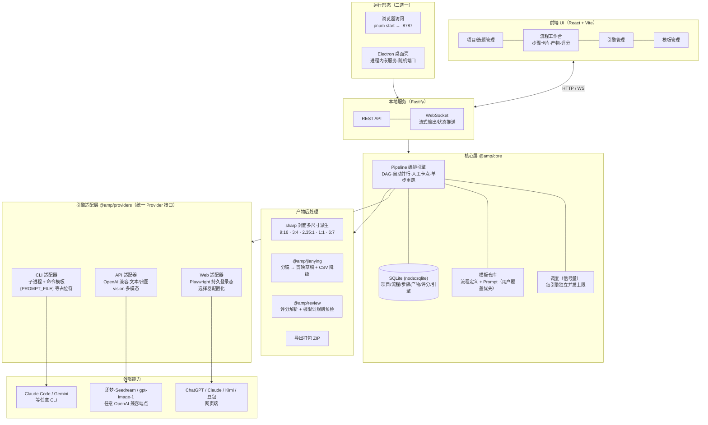
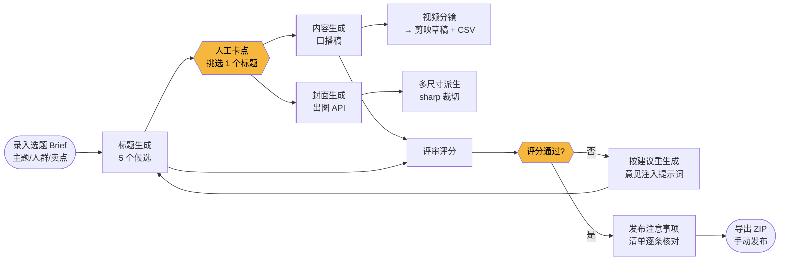
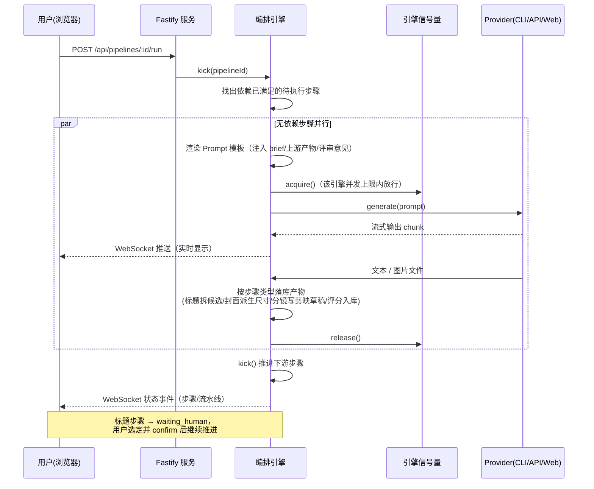
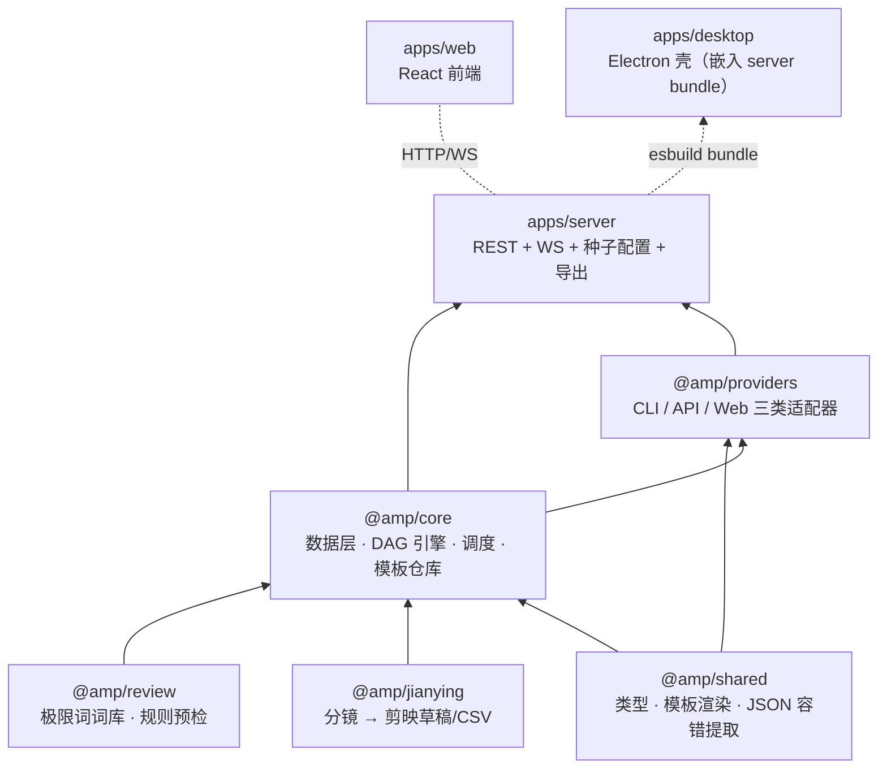
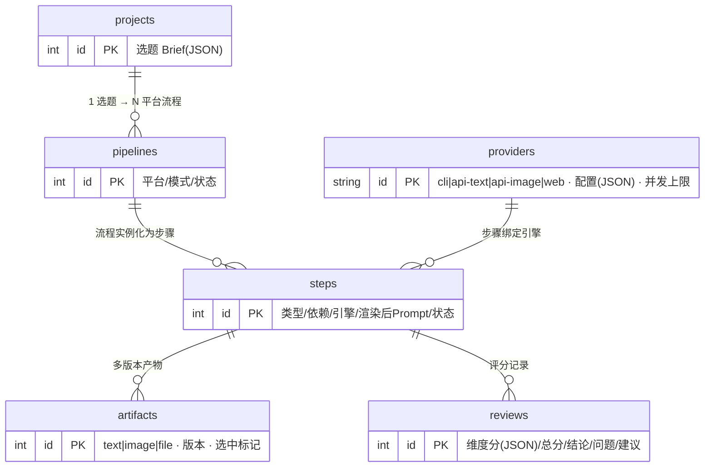

# 自媒体内容工作台 · 架构说明

> 用于对外交流的架构总览。设计细节与决策记录见 [开发说明书.md](开发说明书.md)。
> 文中图表为 Mermaid 格式，GitHub / VS Code / Typora 均可直接渲染。

---

## 1. 一页话总览

**它是什么**：运行在个人电脑上的多平台自媒体内容生产工作台。输入一个选题，按平台规范（小红书 / 抖音 / 微信公众号 / 微信视频号 / 哔哩哔哩 / CSDN，共 11 种内容形态）自动生成标题、正文、封面、视频分镜，每个生成步骤可独立挑选 AI 引擎（本机 CLI / API / 网页端自动化），无依赖步骤并行执行，产物经评审评分与合规预检后一键导出，视频直接产出剪映草稿。

**它不做什么**：不做自动发布（平台风控风险），不自研视频渲染（成片在剪映完成），单机单用户。

---

## 2. 系统架构图

---

## 3. 内容生产流程图（核心业务流）

以「抖音 · 视频」为例（其余 6 条流程同构，步骤有增减）：

关键机制：

- **自动并行**：人工选定标题后，「内容生成」与「封面生成」无依赖关系，引擎自动并行执行；同一选题创建多条平台流程时，跨流程也并行。
- **人工卡点（human-in-the-loop）**：标题生成后流程暂停（`waiting_human`），用户挑选后继续；任何产物事后都可重新点选。
- **单步重跑**：任意步骤可独立重跑，产物按版本保留（v1/v2…），不影响其他步骤。
- **评审闭环**：LLM 多维评分（吸引力/平台契合/清晰度/合规/SEO）+ 本地极限词规则预检双层；「按建议重生成」把评审意见自动注入提示词。

---

## 4. 一次步骤执行的时序图

---

## 5. 模块职责与依赖

| 模块 | 职责 | 关键点 |
|---|---|---|
| `packages/shared` | 类型定义、`{{var}}` 模板渲染、LLM 输出 JSON 容错提取 | 全局零依赖基座 |
| `packages/core` | SQLite 数据层（node:sqlite，零原生编译）、DAG 编排引擎、信号量调度、流程/Prompt 模板仓库 | 引擎只认 Provider 接口，不感知具体实现 |
| `packages/providers` | CLI（子进程+占位符命令模板）、API（OpenAI 兼容文本/出图/vision）、Web（Playwright 持久登录态，选择器配置化） | 新增引擎=实现一个工厂函数 |
| `packages/review` | 极限词/违禁词词库与规则预检 | 与 LLM 评审互补的确定性检查 |
| `packages/jianying` | 分镜 JSON → 剪映草稿目录（draft_content.json）+ 分镜 CSV 降级方案 | 草稿格式非公开，永远同时产出 CSV |
| `apps/server` | Fastify REST + WebSocket、引擎种子配置、ZIP 导出、网页端登录窗口管理 | 可独立运行，也可被 Electron 进程内加载 |
| `apps/web` | 项目/工作台/引擎管理/模板管理四个页面 | 轮询 + WS 双通道刷新 |
| `apps/desktop` | Electron 主进程（esbuild 单文件 server bundle 进程内启动、随机端口）+ electron-builder 安装器配置 | 打包态数据在用户目录、资源随包分发 |

**共享节点库（Node 复用）**：通用节点（封面 cover / 批量出图 batch-images / 内容配图 image-prompts / 评审 review）抽到 `nodes/*.json` 定义一次；流程里用 `"use":"cover"` 引用 + 局部覆盖，封面比例用 `"aspects":[...]` 简写（从 `nodes/sizes.json` 展开）。加平台/形式 = 挑节点拼装，不再复制大段 JSON。

**配置即数据**：11 条平台流程是 `pipelines/*.json`，37 个提示词是 `prompts/**/*.md`（UI 可覆盖），网页端选择器在引擎配置 JSON 里——平台规则变化、站点改版、新增流程都不需要改代码。

---

## 6. 数据模型（ER 图）

文件产物落盘在 `workspace/project-X/pipeline-X/<步骤>/vN/`，数据库只存路径。

---

## 7. 技术栈与关键决策

| 决策 | 选择 | 理由 |
|---|---|---|
| 运行形态 | 本地 Web 服务 + 可选 Electron 壳 | 单机隐私（登录态/密钥不出本机）；两种形态共用同一 server |
| 数据库 | Node ≥22.5 内置 node:sqlite | 零原生编译依赖（解决 Windows 工具链与 Electron ABI 双重问题） |
| 引擎抽象 | 统一 Provider 接口 + 工厂注册 | CLI/API/网页端任意混搭，每步骤独立选择 |
| 并行模型 | DAG + 每引擎信号量 | 步骤级并行、跨流程并行，单站点串行防风控 |
| 网页端自动化 | Playwright 有头模式 + 持久 profile + 选择器配置化 | 登录一次长期复用；改版热修；验证码人工介入 |
| 视频 | 产出剪映草稿而非自研渲染 | 成片质量交给剪映；草稿不兼容时 CSV 分镜表兜底 |
| 评审 | LLM 多维评分 + 本地规则词库双层 | 建议绑定与生成方不同的引擎，避免"自己评自己" |
| 发布 | 不做自动发布，导出 + 注意事项清单 | 规避平台封号风险 |
